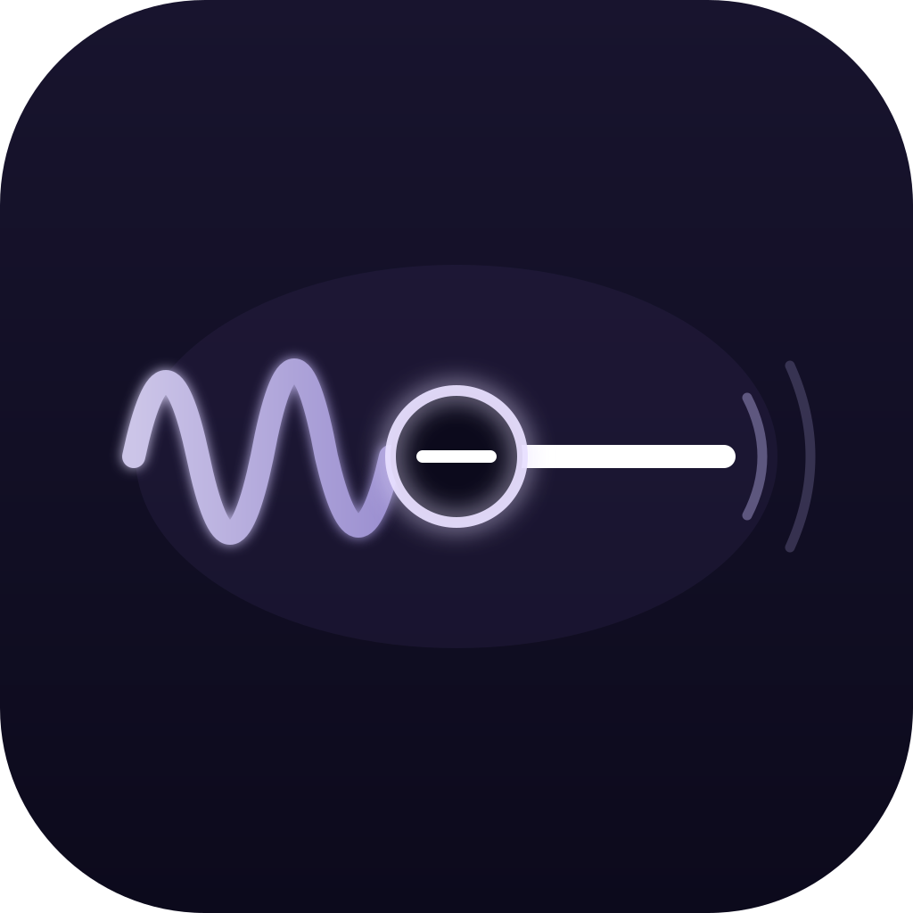

<div align="center">



# mac-aec-relay

**Acoustic echo cancellation for macOS calls, without a paid service**

[](https://www.apple.com/macos/)
[](https://swift.org)
[](https://gitlab.xiph.org/xiph/speexdsp)
[](LICENSE)

**Language** · English · [한국어](docs/ko-KR/README.md) · [日本語](docs/ja-JP/README.md)

</div>

---

## What this is

Take a call on a Mac with external speakers and the other side hears themselves
come back. Their voice leaves your speakers, bounces off the room, and re-enters
your microphone.

macOS ships an echo canceller (`AUVoiceProcessingIO`), but an application has to
opt into it. FaceTime and the Phone app do not expose that choice, and driving
the unit directly turns out to be blocked three separate ways — all three
documented in [Architecture and background](docs/en/architecture.md).

This relay sits between the devices instead. It reads the microphone, reads what
the call app is playing, subtracts the echo with speexdsp, and hands the cleaned
signal back through a virtual device.

> **Honest status:** this reduces echo, it does not eliminate it. Measured 8-14 dB
> of suppression on real calls. The person on the other end went from "there's an
> echo" to "it's fine now", and that is where the work stopped. See
> [Results](#results) for what is and isn't verified.

## How it works

```
  microphone ─────────────┐
                          ├──► [ speexrelay ] ──► BlackHole 2ch ──► call app mic
  BlackHole 16ch ─────────┘         │
       ▲                            └────────────► speakers
       │
  call app output
```

Two virtual devices are needed because the signal crosses the app boundary
twice: once to capture what the call app plays (the reference for cancellation),
once to hand back the cleaned microphone signal.

Cancellation only works if the reference lines up in time with the echo in the
mic. The relay measures that offset by cross-correlation during the first
seconds of a call and applies it while running.

## Install

```bash
brew install speexdsp
brew install --cask blackhole-2ch blackhole-16ch
sudo killall coreaudiod          # so the new drivers are picked up
```

```bash
git clone https://github.com/neocode24/mac-aec-relay.git
cd mac-aec-relay
./build_speex.sh
./install.sh                     # registers a launchd agent and starts it
```

`./install.sh -u` removes it. Logs land in `~/Library/Logs/mac-aec-relay/`.

### Point your call app at it

In FaceTime → Settings, set **Microphone** to `BlackHole 2ch` and **Output** to
`BlackHole 16ch`. The Phone app follows FaceTime's choice, so this is done once.

> **Careful:** while the call app points at BlackHole, the relay has to be
> running. Stop the relay without changing those settings back and the other
> side goes silent.

## Usage

The launchd agent keeps it running, so day to day there is nothing to do. For
measurement and debugging it also runs directly:

```bash
./speexrelay --mode aec --autocal          # normal operation
./speexrelay --mode bypass                 # pass through, for A/B comparison
./speexrelay --devices                     # list devices and their UIDs
```

Devices default to the system input and output. Override by name fragment or UID:

```bash
./speexrelay --mode aec --autocal --mic Maono --spk DELL
AEC_MIC_UID=... AEC_SPK_UID=... ./speexrelay --mode aec --autocal
```

| Option | Default | What it does |
|---|---|---|
| `--mode aec\|bypass` | `aec` | Cancel, or pass through unchanged |
| `--autocal` | off | Measure reference delay during the call. Required in practice |
| `--refdelay <ms>` | 0 | Set that delay by hand instead |
| `--tail <ms>` | 400 | Filter length; how long an echo it can model |
| `--frame <n>` | 480 | Samples per processing block |
| `--esup <dB>` | -40 | Residual suppression while nobody talks |
| `--esup-active <dB>` | -15 | Residual suppression while the far side talks |
| `--mic`, `--spk` | system default | Device by UID or name fragment |
| `--duration <s>` | until Ctrl-C | Stop after N seconds |
| `--record <path>` | off | Write output as f32le mono 48k |
| `--farfile <path>` | off | Play a file as the reference, for bench measurement |
| `--devices` | — | List devices and exit |

### Managing the agent

```bash
launchctl print    gui/$(id -u)/com.neocode24.aecrelay   # status
launchctl kickstart -k gui/$(id -u)/com.neocode24.aecrelay   # reload after rebuild
launchctl bootout  gui/$(id -u)/com.neocode24.aecrelay   # stop
tail -f ~/Library/Logs/mac-aec-relay/relay.log
```

## Reading the log

```
[ 54s] mic -51.6/-70.0  ref -15.2/-32.9  out -64.7/-83.8  aecFrames=5348 refZero=3762
       ring mic=0 ref=4288(89ms drop=8992) refSpk=512(11ms drop=22336) out=832
```

- `mic` raw microphone, `ref` reference, `out` after cancellation (peak/rms)
- **Suppression is `mic` minus `out` while only the far side is talking.**
  While you talk it should be near zero — your voice must not be removed.
- `ref=N(Xms)` reference delay, should sit near 100 ms
- `refSpk=N(Xms)` speaker output delay; growth here means the far side sounds late
- `micCb`/`spkCb`/`bh16Cb`/`bh2Cb` four callback counters, all should keep rising
- `underrun` non-zero means audio is dropping out

At startup you get `정합 캘리브레이션: 신호 대기 중`, and once the far side speaks,
a `lag=... corr=...` line followed by `refdelay 적용:`. **Without those two lines
the relay is running uncalibrated and cancels almost nothing.**

## Results

Measured 2026-09-12 on the machine this was built for.

| Condition | Suppression (mic → out) |
|---|---|
| Real call | 8-14 dB |
| Bench, far side only | 5.6-9.4 dB |
| Bench, both talking | -0.6 to 10.8 dB |

Real-call detail, far side talking only:

| ref | mic | out | suppression |
|---|---|---|---|
| −1.0 | −39.5 | −49.0 | 9.5 |
| −15.2 | −51.6 | −64.7 | 13.1 |
| −22.0 | −56.5 | −71.2 | 14.7 |

The three conditions are close, and that matters: an early conclusion that
double-talk was the bottleneck did **not** survive re-measurement on a consistent
basis. What actually limits suppression here is still unidentified.

### Known to make it worse

Both verified by reverting them.

| Change | Suppression |
|---|---|
| Current settings | 8-14 dB |
| Reference + speaker buffers 100 ms → 50/40 ms | 1-3 dB |
| Speaker buffer alone 100 → 40 ms | 3-7 dB |
| Realign delay line and reset the filter on gaps | 3.4-5.6 dB |
| Gate the output after a silent reference tail | 0.8-4.8 dB |

The samples those buffers hold **are** the echo the filter needs. Drop them and
the path it learned no longer matches. Tune output latency with `bh2MaxBacklog`,
which is not part of the cancellation path.

## Self-recovery

Audio devices can vanish — an HDMI monitor sleeps, `coreaudiod` restarts — and
when they do, IOProc callbacks stop while the process stays alive and keeps
logging. This once left the relay silently broken for 4h45m.

It now checks all four callback counters every 30 seconds and calls `exit(1)` if
any one of them stopped rising. launchd starts a fresh process, which re-resolves
device UIDs against whatever is present. The check looks only at counters, never
at dB values, because silence and successful cancellation measure the same. It
skips the first 30 seconds and any interval longer than 35 seconds, so waking
from sleep does not trigger it.

Verified by `sudo killall -9 coreaudiod`: the process exits within 30 seconds and
launchd brings it back with counters rising again.

## Documentation

| Document | Contents |
|---|---|
| [Architecture and background](docs/en/architecture.md) | Why echo happens, why VPIO is unreachable, signal flow, code structure, traps hit while building this |
| [Testing on a real call](docs/en/testing.md) | Running a real-call test and reading the log |

## Measurement tools

Included because the measurement rig is most of the work — and because the first
version of it was wrong in a way that cost three failed fixes.

| Script | Purpose |
|---|---|
| `pm_verify_autocal.sh` | A/B against bypass mode |
| `pm_doubletalk.sh` | Both sides talking at once |
| `pm_delay_probe.py` | Cross-correlation delay measurement |
| `pm_delay_sweep.sh` | Sweep suppression across `--refdelay` values |
| `pm_split_measure.py` | Per-segment levels, to see drift across a long utterance |

## Limitations

- Built and verified on one machine. Treat the numbers as a starting point.
- Echo is reduced, not removed.
- Start-on-call detection was attempted and abandoned: `avconferenced` does not
  claim audio devices in a way that polling can detect. The relay runs continuously.
- Only FaceTime and the Phone app are routed. Teams, Slack and others have their
  own cancellation and are left alone.

## License

[MIT](LICENSE) © 2026 neocode24

Uses [speexdsp](https://gitlab.xiph.org/xiph/speexdsp) (BSD 3-Clause). Headers are
read from the Homebrew install; none are vendored in this repository.
